# Job Board

Job Board is website where users can apply to Jobs. We can add new, edit or delete Job Listing. Users can also filter jobs according to job name, salary, category and experience. 

# Job Board uses the following technologies:

- [Laravel](https://laravel.com/)
- [Tailwind CSS](https://tailwindcss.com/)
- [Apline.js](https://alpinejs.dev/)
- MySQL as database

This the dasboard of the Job Board.
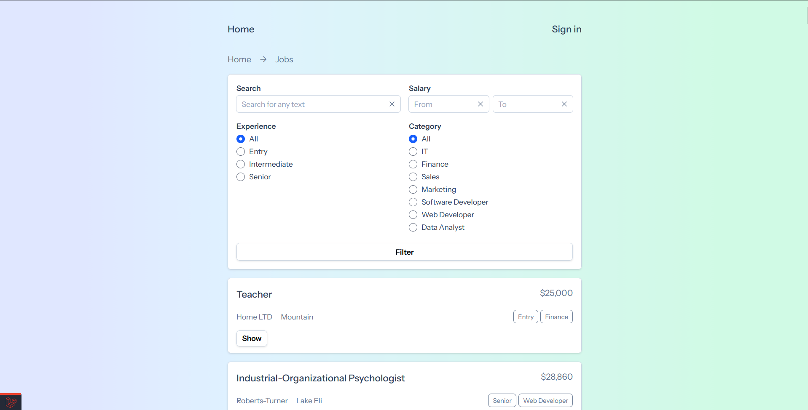

This shows the other job listings.
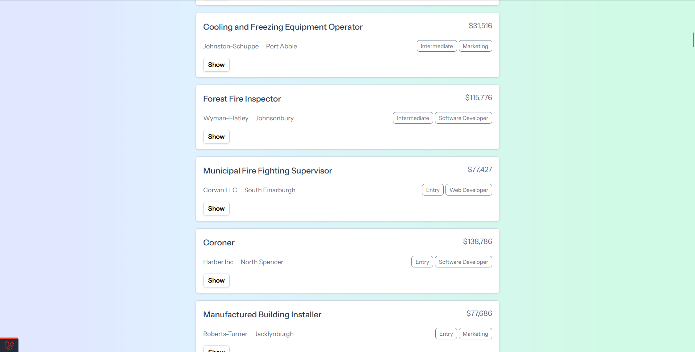

We can filter the job listing by using the options presented.
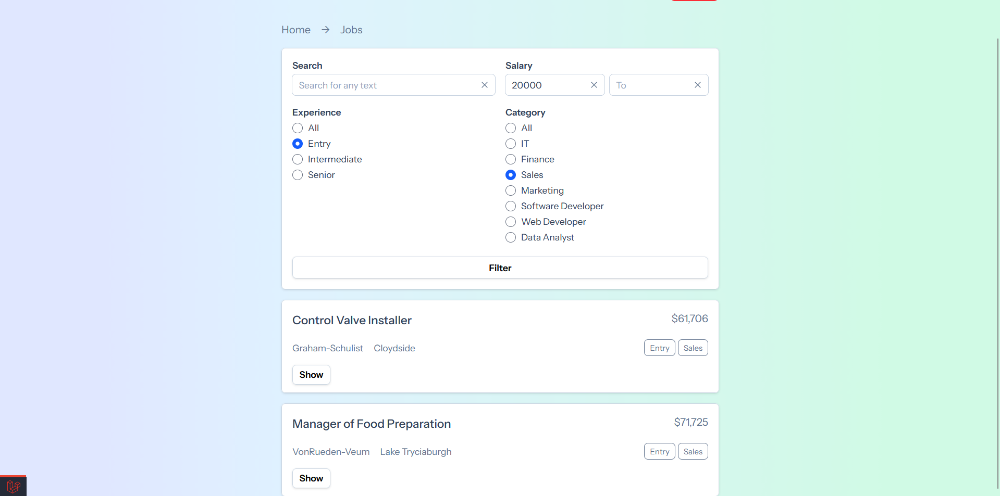

This is the sign up page.
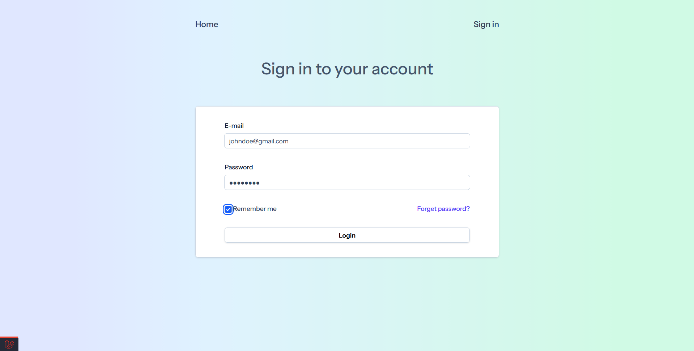

We can taken to another page we will click on the show button of any job listing.
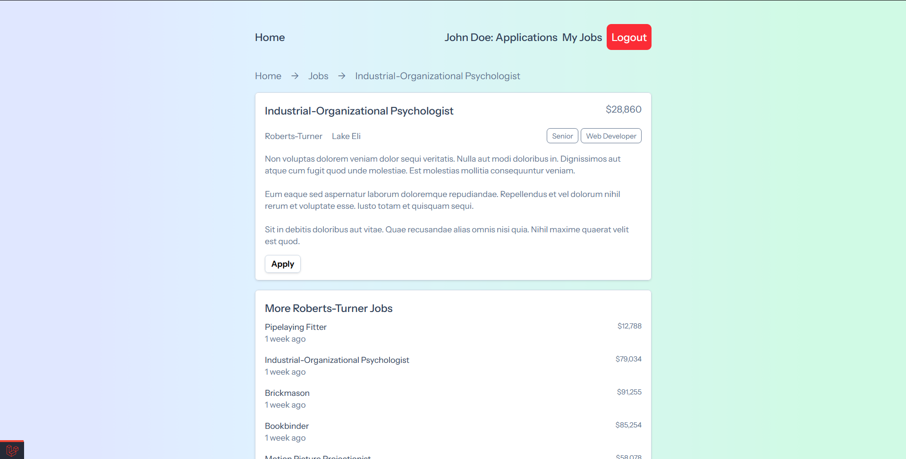

We can click on the apply button, it will take us to page where we can type the expected salary and add our CV.
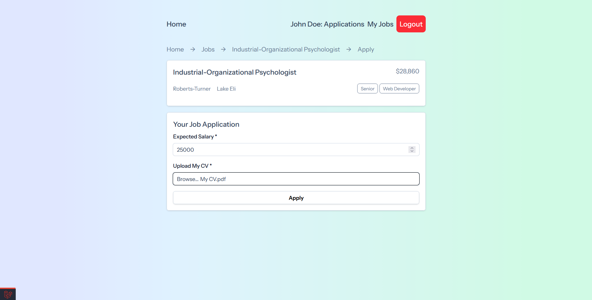

Once done, we can see that we have applied to this job and we can no longer can apply to it again.
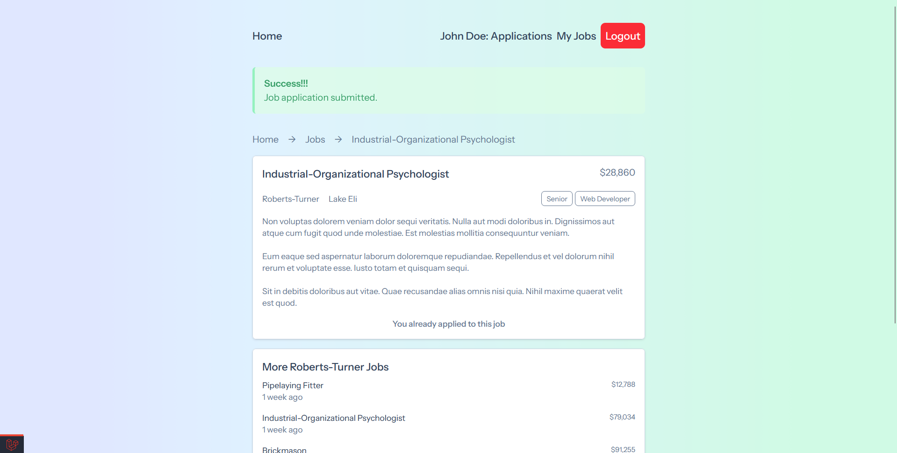

We can see all the jobs that we have applied.
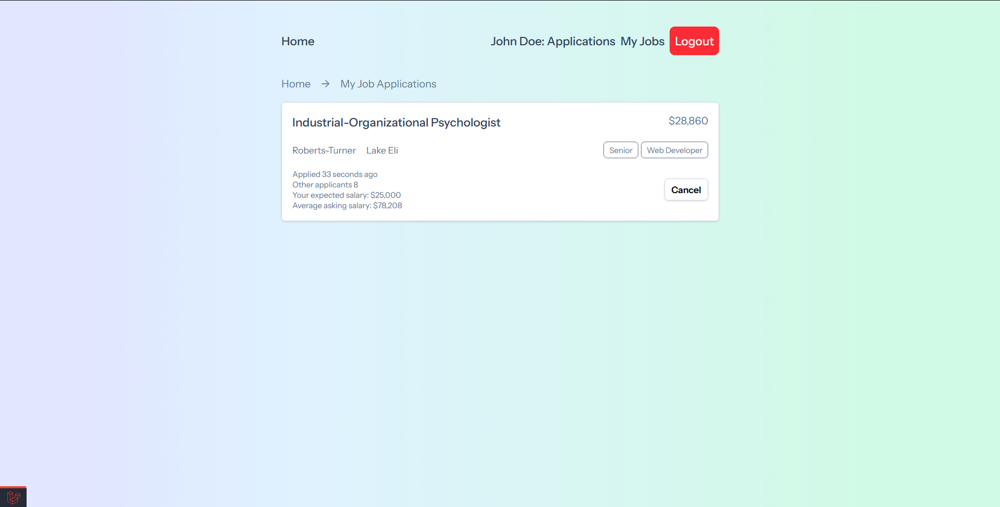

We can see all the jobs that we have created.
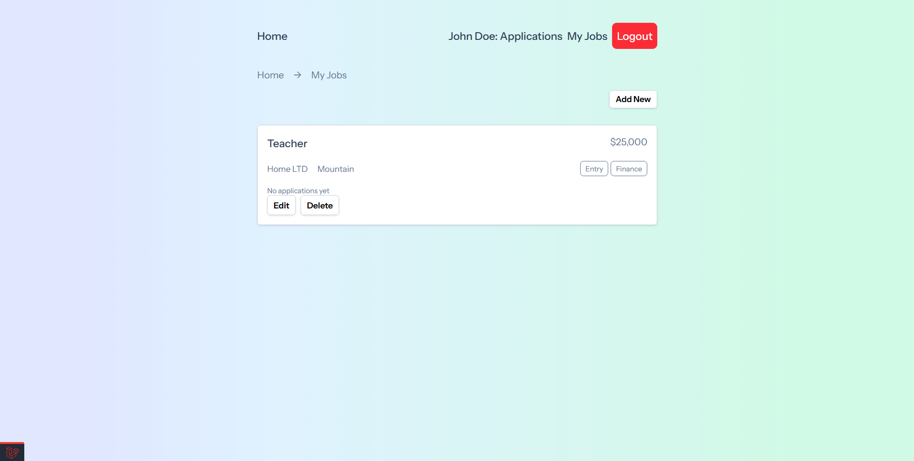

This the add new job page.
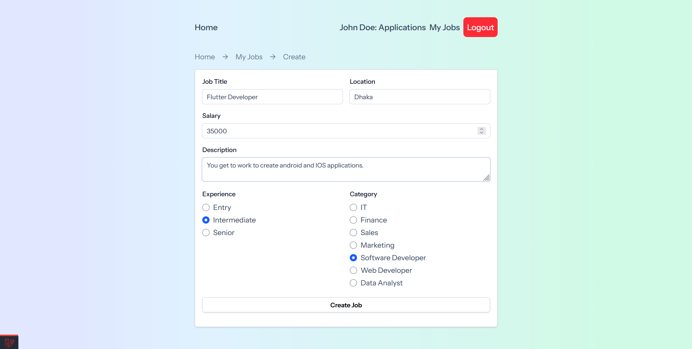

After creating we can see that job.

After deleting a job we can see that job as deleted red caption with that.
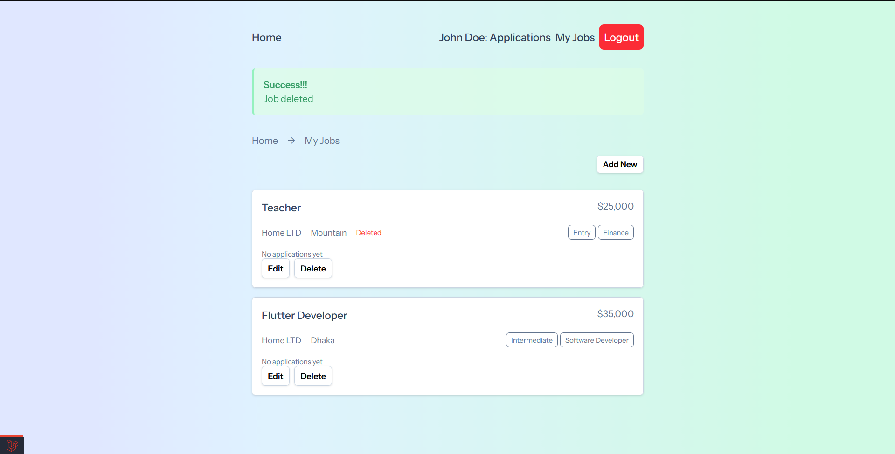
